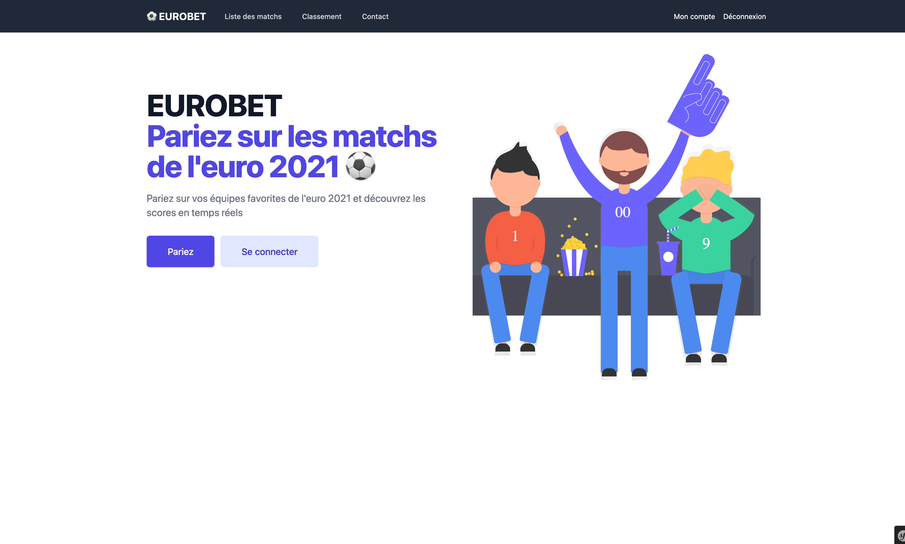
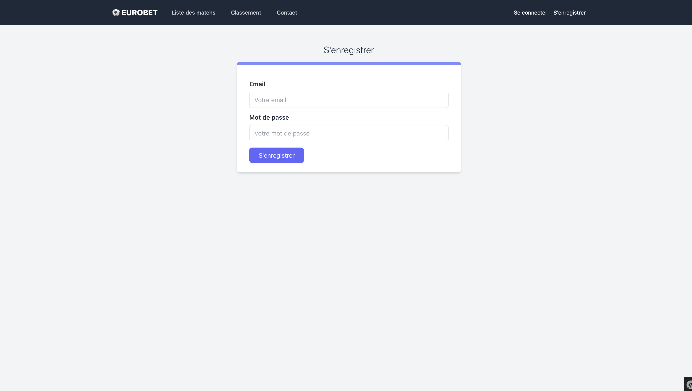
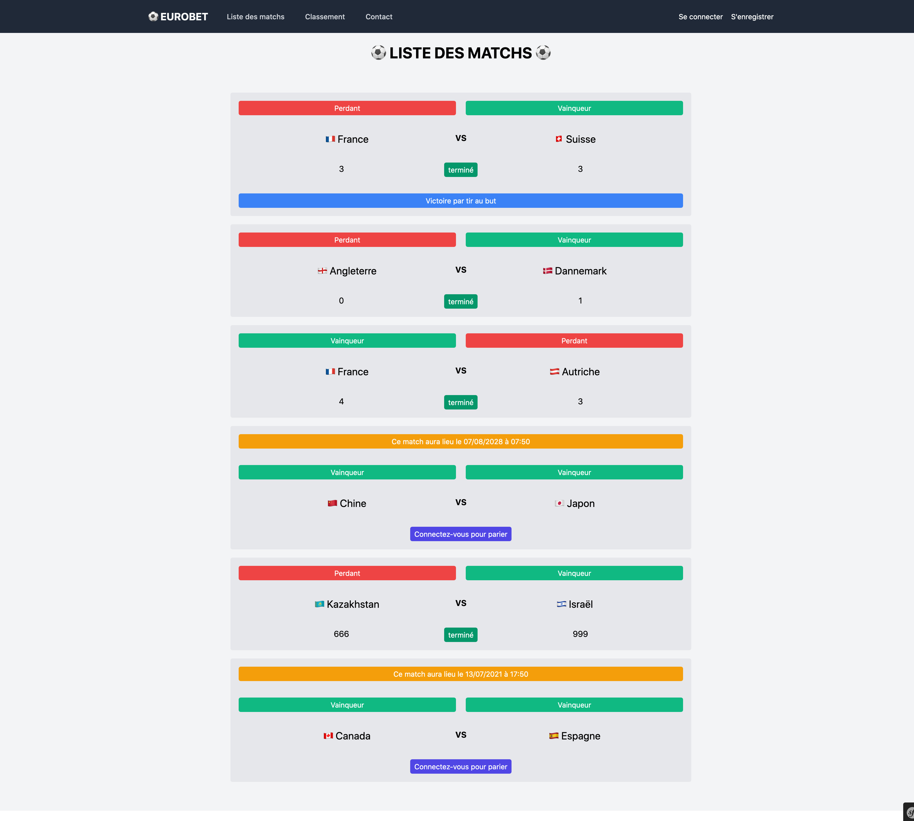
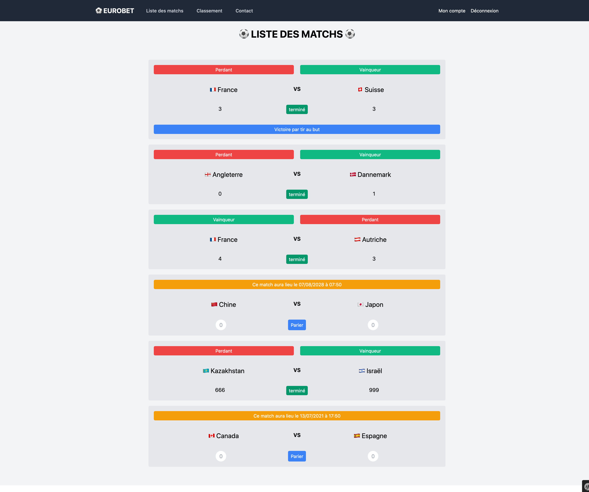
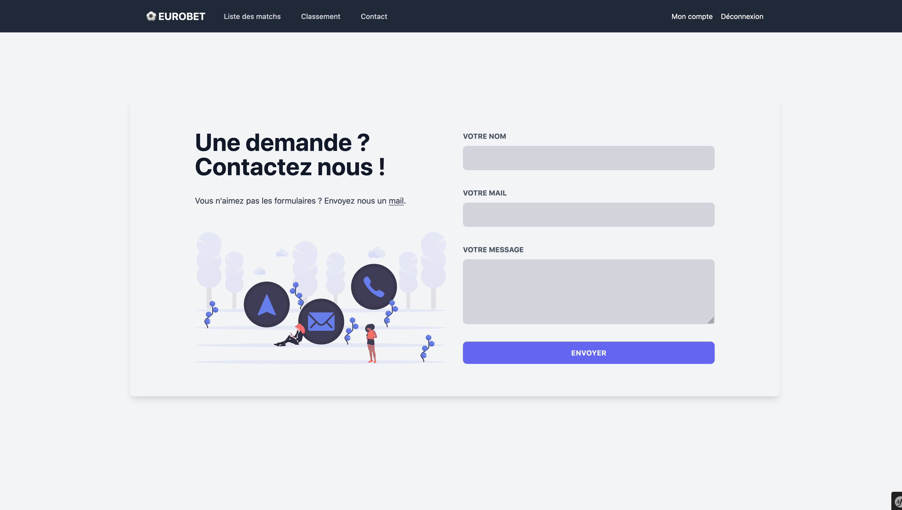
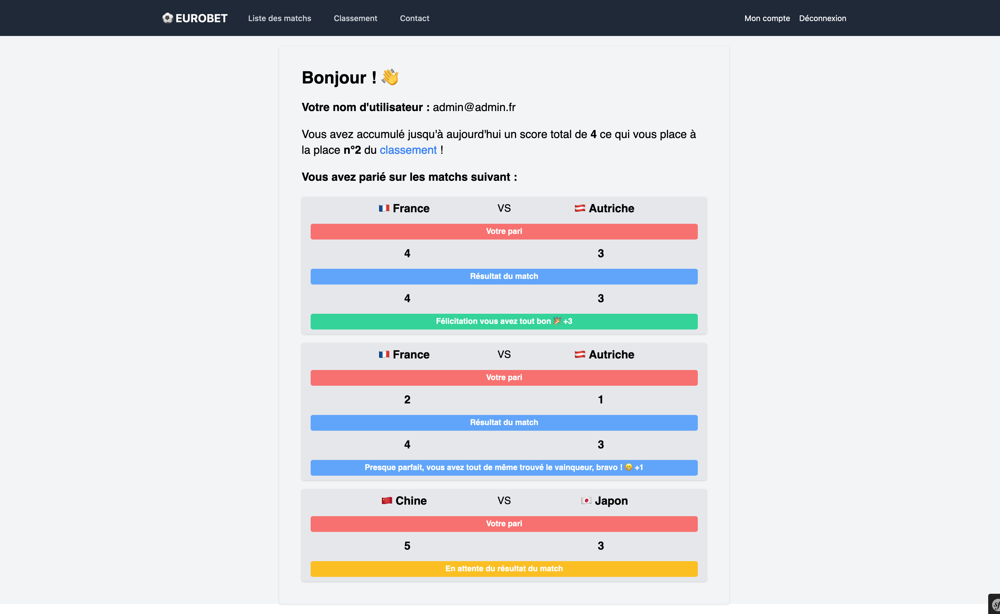
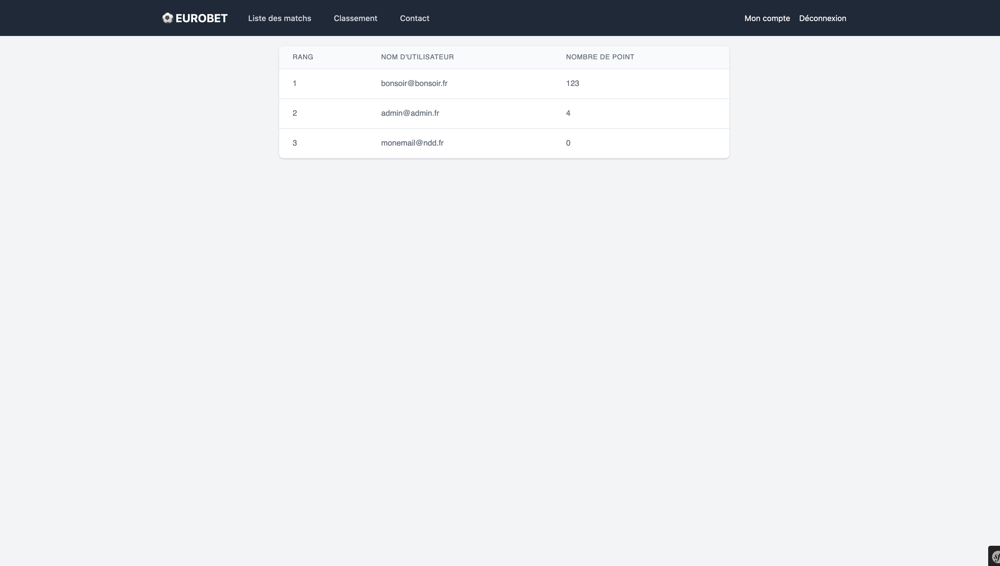

# ⚽ EUROBET ⚽️

### Projet de Licence 3 Informatique

**Matière** : Web avancé

**Enseignant** : Antoine Daudenthun

___
## Installation 

**Étape 1** : Clone le projet.

**Étape 2** : Lancer le docker-compose.

**Étape 3** : Importer la base de données à l'aide du fichier `assets/sql/eurobet.sql` que vous pouvez trouver à la racine du projet.

**Étape 4** : Se rendre sur le site à l'url suivante : http://local.project.com/

**Étape 5** : S'inscrire ou se connecter à l'aide du compte :

- Email : `admin@admin.fr`
- Mot de passe : `admin`

**Étape 6** : Utiliser le site
___
## Démonstration ( Sreenshots )

* Page d'accueil

* Page de création de compte

* Page de connexion

* Page avec liste des matchs

    * Si non connecté
      
    * Si connecté
      

* Page de contact

* Page info compte

* Page Classement

